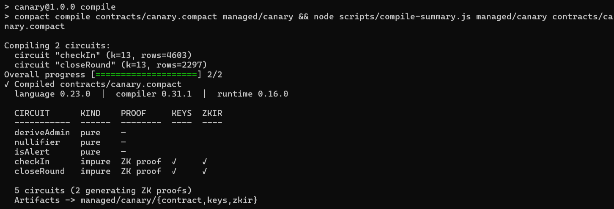
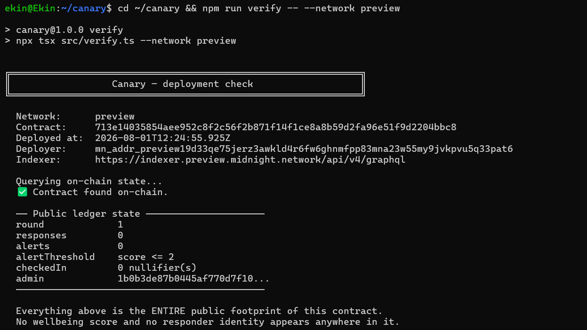

# Canary

[](https://github.com/EkinOnat/midnight-canary/actions/workflows/ci.yml)

> An anonymous early-warning pulse for teams: members submit a private wellbeing score from their browser, and the chain learns only how many people are struggling — never who, and never their score.

## Live Demo

**https://midnight-canary.vercel.app**

Connect Lace on Preview and check in. The public counters load without a
wallet, so you can see the contract's live on-chain state before connecting
anything.

## Contract Address

| Network  | Address                                                            |
|----------|--------------------------------------------------------------------|
| Preview  | `713e14035854aee952c8f2c56f2b871f14f1ce8a8b59d2fa96e51f9d2204bbc8` |
| Preprod  | _not deployed — see note below_                                    |

Deployer wallet (Preview): `mn_addr_preview19d33qe75jerz3awkld4r6fw6ghnmfpp83mna23w55my9jvkpvu5q33pat6`
Deploy transaction: `8342fa92366596f8a1b8088e4b7d2615916021d60f9db00efdfa5450ead3c03f`

> **On Preview vs Preprod.** The Midnight **Preprod** environment is currently
> down and its faucet is out of service — `wss://rpc.preprod.midnight.network`
> hangs on wallet sync. The Midnight ecosystem team directed builders to deploy
> on **Preview** instead, using https://faucet.preview.midnight.network/. This
> project therefore targets Preview, and the frontend defaults to the Preview
> address above. The network is a single environment variable
> (`VITE_MIDNIGHT_NETWORK`) and `src/network.ts` already carries full Preprod
> config, so switching back is a one-line change once Preprod returns.

<sub>A `hello-world` contract was also deployed to Preview at
`3ae77641aa1122229570d8a813b7e65058253d900c780753e0d29e7e9d0e16b5` to validate the
deployment pipeline before building Canary.</sub>

## What This Does

Every organisation that has ever run an anonymous wellbeing survey has the same
problem: nobody believes it's actually anonymous. The survey tool can see your
answer. HR can see your answer. So people answer strategically, and the signal
the organisation gets back is worthless precisely when it matters most.

Canary fixes that at the cryptographic level rather than the policy level.

A team runs a **pulse round**. Each member opens the dApp, connects their Lace
wallet, and picks a wellbeing score from 1 to 5. The score is used to build a
zero-knowledge proof on their own machine and is then discarded. What lands
on-chain is:

- how many people checked in, and
- how many of them were at or below the alert threshold.

That's it. Not the scores. Not who submitted. Not even *whether a specific person*
submitted. The organisation gets an honest aggregate — "9 responses, 4 alerts" —
and no one, including whoever deployed the contract, can decompose it back into
individuals.

Each person can only check in once per round, enforced by a **nullifier**: a
one-way hash of their secret key and the round number. It proves "an eligible
person who hasn't already checked in is checking in now" without identifying
them. Because the round number is mixed into the hash, the same person's
nullifiers across different rounds are unlinkable — you can't follow someone's
trajectory over time.

## Privacy Model

**PUBLIC** — on-chain, visible to anyone:

| Field | Meaning |
|---|---|
| `round` | Which pulse round is currently open |
| `responses` | How many people checked in this round |
| `alerts` | How many of those were at or below the threshold |
| `checkedIn` | Set of opaque 32-byte nullifiers |
| `alertThreshold` | The cutoff (default 2), public so the aggregate is interpretable |
| `admin` | A hash of the deployer's secret, used to gate `closeRound()` |

**PRIVATE** — witnesses that never leave the responder's machine:

| Witness | Meaning |
|---|---|
| `localSecretKey()` | The responder's 32-byte identity secret |
| `wellbeingScore()` | The actual 1–5 score |

Neither is ever written to the ledger, passed as a public circuit argument, or
included in a transaction. They exist only as inputs to the zero-knowledge proof.

In the browser this is enforced structurally as well as cryptographically. The
score is held in a React `ref`, never in component state, and is cleared before
the proof begins — so it is not rendered, not serialisable from a devtools
snapshot, and not present in the DOM after you pick it. The identity secret is
generated locally with `crypto.getRandomValues`, stored encrypted in the
browser's private-state store, and only ever shown as a six-character
fingerprint. See [`src/components/CircuitCall.tsx`](src/components/CircuitCall.tsx)
and [`src/lib/identity.ts`](src/lib/identity.ts).

**What the user PROVES without revealing:**

> "I hold a secret key, I have not already checked in this round, and my score is
> a valid value between 1 and 5."

...while revealing exactly two things:

1. **A round-scoped nullifier.** A one-way hash — it identifies nobody, and is
   unlinkable across rounds.
2. **One bit** — whether the score was at or below `alertThreshold`.

That single bit is the entire deliberate disclosure of this contract, and it is
the whole reason `disclose()` appears in the source:

```compact
// Disclosure #2 — and the last: exactly one bit about a private score.
if (disclose(isAlert(score, alertThreshold))) {
  alerts.increment(1);
}
```

A score of 1 and a score of 2 are **indistinguishable on-chain** (both alert), as
are 3, 4 and 5 (none alert). This isn't a claim in a comment — it's asserted in
the test suite, which runs two check-ins differing only in the private score and
requires the resulting public state to be byte-identical. See
[`tests/canary.test.ts`](tests/canary.test.ts), block 5.

## Privacy Claim

**An on-chain observer sees:**

- that a transaction touched the Canary contract, and when;
- a 32-byte nullifier that was added to the `checkedIn` set;
- `responses` incremented by one;
- `alerts` either incremented by one, or not — one bit;
- the fee payment, and therefore the paying wallet.

**An on-chain observer cannot see:**

- **the wellbeing score.** Scores 1 and 2 produce byte-identical public state, as
  do 3, 4 and 5. The score never enters the transaction in any form — not
  encrypted, not committed, not at all.
- **which person submitted.** The nullifier is `persistentHash("canary:nul:v1",
  round, secretKey)`. The secret key is generated in the browser and never
  transmitted; the hash is one-way. It is not derived from the wallet key, so
  the fee-paying wallet does not identify the responder either.
- **whether the same person answered in two rounds.** The round number is mixed
  into the hash, so one person's nullifiers across rounds are unlinkable — you
  cannot follow anyone's trajectory over time.
- **whether a given person participated at all.** Nothing on-chain links a
  nullifier to an identity, so non-participation is indistinguishable from
  participation by someone else.

The proof itself is generated by the user's own wallet on the user's own
machine. This dApp has no backend: the deployed site is static files, and the
only network calls it makes are to the Midnight indexer the wallet nominates.

### Known limits

Honest about what this does *not* do:

- **Aggregate leakage.** With one responder, `alerts` trivially reveals that
  person's bracket. The privacy guarantee is meaningful at team scale, not n=1.
- **Eligibility is open.** Anyone holding any secret key can check in once; the
  contract does not yet verify membership in an allowlist. Adding a Merkle-tree
  membership proof is the natural next step.
- **Timing metadata.** The chain sees *when* each check-in transaction arrives,
  and which wallet paid the fee. A determined observer correlating submission
  times and fee-payers with other signals could narrow down who submitted, even
  though the contract itself reveals nothing.

### A note on identity

Identity is derived from a hash of a private secret, **not** from
`ownPublicKey()`. `ownPublicKey()` returns a prover-claimed value with no
cryptographic binding to the transaction signer, so any access check built on it
is bypassable. The admin role is `persistentHash("canary:admin:v1", secret)`,
frozen into the ledger at construction.

## Tech Stack

- **Midnight Network** — Preview testnet
- **Compact** — language version 0.23.0 (compiler 0.31.1, `compact` CLI 0.5.1)
- **Midnight.js SDK** 4.1.1 — `midnight-js-contracts`, `-types`, `-protocol`,
  `-indexer-public-data-provider`, `-fetch-zk-config-provider`,
  `-level-private-state-provider`, `-network-id`, `-utils`
- **DApp Connector API** `@midnight-ntwrk/dapp-connector-api` 4.0.1
- **Lace wallet** — connection, local proof generation, fee payment, submission
- **React 19 + Vite 8** — static frontend, no backend
- **Fraunces** and **Sometype Mono**, both OFL-1.1 and **self-hosted** — a font
  CDN would make the "no third-party requests" claim false
- **Node.js** v22
- **Vitest** 4.1 for the contract test suite

### Interface

The layout is the privacy model. The page is split by a labelled seam:
everything left of it happens on your machine, everything right of it is public
on-chain. Colour temperature, typeface and texture all flip at that seam — your
side is dim and warm, the chain's side is bright and cold — so you can see which
side your answer is on without being told. The seam is labelled with the only
two things that ever cross it: **one hash, one bit**.

The score you pick is never rendered after you pick it. The buttons are replaced
by "Kept to yourself", and the value lives in a ref rather than React state, so
it is absent from the DOM, from devtools snapshots, and from the profiler.

Every text element meets WCAG AA contrast — measured, not assumed: the lowest
ratio anywhere on the page is 5.15:1 against a 4.5:1 requirement. The score
buttons are 46 px, comfortably past the 44 px guidance for a primary target.
Focus is visible on keyboard navigation, `prefers-reduced-motion` is respected,
and proof progress is announced through a live region that is mounted before it
has anything to say — mounting it alongside its own first message is the case
screen readers routinely miss.

## Prerequisites

- **Lace wallet** installed, switched to **Preview**, funded, **and generating
  DUST** — see below
- **Node.js v22+**

### Funding is two steps, not one

This catches people out, so it is worth being explicit. Fees on Midnight are
paid in **DUST**, and the faucet does not hand out DUST — it hands out tNIGHT.
DUST cannot be sent or bought; it is *generated* by NIGHT that you have
delegated to a DUST address, and it accrues over time.

1. Get tNIGHT from https://faucet.preview.midnight.network/ using your
   **unshielded** address.
2. In Lace, use **"Generate tDUST"** to delegate that tNIGHT, and confirm the
   transaction. Generation starts about a minute later (three blocks) and builds
   from there.

A wallet holding tNIGHT with zero tDUST looks funded and is not. It will run the
circuit, generate the proof, and even balance and sign the transaction — the
network only refuses it at submission. The dApp now checks the DUST balance
before proving and says which of the two steps is missing, rather than spending
a minute to fail.

To build the contract from source you additionally need:

- **Linux or macOS** (Midnight's toolchain does not support Windows natively —
  see the Windows note below), Docker for the proof server, and the Compact
  toolchain:
  ```bash
  curl --proto '=https' --tlsv1.2 -LsSf https://github.com/midnightntwrk/compact/releases/latest/download/compact-installer.sh | sh
  ```
  Then `compact update`, and confirm both:
  ```bash
  compact --version && compact compile --version
  ```

The frontend itself needs none of that — the compiled circuits are committed to
`managed/`, so `npm install && npm run dev` works on any platform, Windows
included.

## Setup & Run Locally

```bash
git clone https://github.com/EkinOnat/midnight-canary.git canary
cd canary
npm install
```

```bash
npm run dev
```

That's it — the app defaults to the live Preview contract in the table above, so
there is nothing to configure. To point it at your own deployment instead, copy
`.env.example` to `.env` and set `VITE_CONTRACT_ADDRESS` and
`VITE_MIDNIGHT_NETWORK`.

Open http://localhost:5173, connect Lace, pick a score, and check in.

`npm run dev` first runs `scripts/copy-zk-assets.js`, which stages the prover
keys and ZKIR from `managed/canary/` into `public/managed/canary/` where
`FetchZkConfigProvider` can fetch them over HTTP. They are not committed —
they're 5.4 MB of binaries regenerated from `managed/` on every run.

### Deploy the contract

Only needed if you want your own instance. Run this on Linux/macOS (or WSL2) with
Docker running:

```bash
npm install
docker compose up -d --wait proof-server
npm run deploy -- --network preview
```

The script prints a wallet address and then polls until you fund it from
https://faucet.preview.midnight.network/ — it continues by itself once the
tNIGHT lands. Confirm the result:

```bash
npm run verify -- --network preview
```

### Deploy the frontend

The repo ships a [`vercel.json`](vercel.json). Note its SPA rewrite excludes
`/managed/` — `FetchZkConfigProvider` hard-errors if a prover-key request comes
back as `text/html`, which is what an unguarded catch-all fallback would return.

```bash
npx vercel link
```

```bash
npx vercel --prod
```

No environment variables are needed — `src/config.ts` defaults to Preview and
the contract address above. Set `VITE_MIDNIGHT_NETWORK` and
`VITE_CONTRACT_ADDRESS` via `npx vercel env add ... production` only if you are
hosting your own deployment.

## Run Tests

```
npm test
```

35 tests, run against the real compiled contract in-process — no node, proof
server or funded wallet needed. 24 cover the contract and 11 cover the wallet
connector.

`tests/canary-simulator.ts` drives the generated circuits through a local
`QueryContext`, so these exercise the actual ZK logic rather than a mock of it.

**Contract — `tests/canary.test.ts`**

1. **Circuit logic** — the nullifier is deterministic, round-scoped, unlinkable
   across rounds, and domain-separated from the admin commitment; `isAlert`
   classifies correctly on both sides of the threshold.
2. **State transitions** — check-ins increment `responses`; only scores at or
   below the threshold also increment `alerts`; out-of-range scores are rejected.
3. **Double check-in** — a second check-in in the same round is refused and the
   tally is left untouched.
4. **Round rollover and access control** — the admin can close a round (clearing
   counters and nullifiers); a non-admin cannot.
5. **Private inputs are never exposed** — scores 4 and 5 produce byte-identical
   public state; scores 1 and 4 differ in the `alerts` counter and *nothing else*;
   no raw secret key ever appears in public state.

**Connector — `tests/connector.test.ts`**

6. **Wallet error mapping** — every string in these assertions came out of a real
   Lace 4.0.1 wallet. Lace reports a network disagreement as a plain `Error`, so
   message text is the only thing available to branch on, and a silent regression
   would replace an actionable instruction with a raw stack trace at exactly the
   moment someone is trying to connect.

## CI/CD

[`.github/workflows/ci.yml`](.github/workflows/ci.yml) runs on every push to
`main` and on every pull request against it. Two jobs, both required for the
badge at the top of this file to be green:

| Job | Steps | Why it is separate |
|---|---|---|
| **Test & build** | checkout → Node 22 → `npm ci` → `npm test` → `npm run build` | Needs only Node, so it reports in about 25 seconds. The build step is what proves the dApp compiles with zero errors. |
| **Compact compile** | checkout → Node 22 → `npm ci` → install the Compact toolchain → `compact update` → `npm run compile` | Has to download the Compact toolchain from an upstream release, which is slower and can fail for reasons unrelated to this repo. Split out, a toolchain outage reads differently from a broken test. |

The compile job installs the same toolchain the Prerequisites section documents,
then runs the real compiler — it is not a cached artifact check. Its log prints
the circuit table from [`scripts/compile-summary.js`](scripts/compile-summary.js),
which fails the job if any ZK circuit is missing its prover key, verifier key or
ZKIR.

`managed/` is committed, so the frontend job never needs the Compact toolchain —
which is also why `npm install && npm run dev` works on Windows.

## Product Proposal

See [PROPOSAL.md](PROPOSAL.md) — what the product is, who uses it, why it needs
Midnight specifically, the public/private data model, and the path to Mainnet.

## Demo Video

**https://youtu.be/8H8-Ta2fb9g**

Connecting Lace on Preview, then a live `checkIn` call: the score is picked and
immediately hidden, the proof is generated locally, and the transaction lands
on-chain — with the public counters moving and the score never appearing
anywhere on screen.

## Verify the Deployment

Reads the contract's public state straight back off the indexer. Needs no wallet
and no funds — public state is public, so this runs from a fresh clone:

```bash
npm run verify -- --network preview
```

The address comes from `--address` if given, then your local deployment record,
then the address this project published. That last fallback matters: the record
lives in `.midnight-state.json`, which is gitignored because it also holds the
wallet seed — so without it, the command that exists to let *someone else*
confirm the contract is real only ever ran for whoever deployed it. Pass
`--address <hex>` to point it at any other Canary deployment.

```
  Network:      preview
  Contract:     713e14035854aee952c8f2c56f2b871f14f1ce8a8b59d2fa96e51f9d2204bbc8
  Source:       published address for preview (no local deployment record)
  Indexer:      https://indexer.preview.midnight.network/api/v4/graphql

  Querying on-chain state...
  ✅ Contract found on-chain.

  ── Public ledger state ─────────────────────
  round             1
  responses         1
  alerts            0
  alertThreshold    score <= 2
  checkedIn         1 nullifier(s)
  admin             1b0b3de87b0445af770d7f10...
  ────────────────────────────────────────────
```

That output is the *entire* public footprint of the contract. No score and no
responder identity appears anywhere in it.

It is also a live check-in rather than a fresh deployment, which makes it a
sharper demonstration of the privacy model than an empty contract would be.
Someone answered — `responses` is 1, and a nullifier is recorded so they cannot
answer again this round. `alerts` is 0, so their score was above the threshold:
a 3, a 4 or a 5. **Which of the three is not recoverable from anything above**,
and neither is who they were. The nullifier is a one-way hash of a secret that
never left their browser, and it is not derived from the wallet that paid the
fee. One bit crossed the boundary, which is exactly what the contract promises.

The call is verifiable independently of this repo — the most recent contract
action at that address is a `ContractCall` in block 349680:

```bash
curl -s -X POST https://indexer.preview.midnight.network/api/v4/graphql \
  -H 'Content-Type: application/json' \
  -d '{"query":"{ contractAction(address: \"713e14035854aee952c8f2c56f2b871f14f1ce8a8b59d2fa96e51f9d2204bbc8\") { __typename transaction { hash block { height } } } }"}'
```

## Interact From the CLI

```bash
npm run cli
```

Private check-in, a public-pulse view, and an admin close-round action. Your
responder identity is derived locally from a passphrase you type, so a single
operator can exercise a multi-person round.

`closeRound()` is CLI-only by design: it is gated on a hash of the *deployer's*
secret, which a Lace key cannot produce, so exposing it in the browser would only
ever fail.

## How the Browser Talks to Midnight

`@midnight-ntwrk/dapp-connector-api` v4 replaced the older
`window.midnight.mnLace.enable()` shape. Wallets now inject one or more
`InitialAPI` objects under `window.midnight`, and the dApp picks one and calls
`connect(networkId)`. Midnight.js wants six providers; four are off-the-shelf and
two are the adapter in [`src/lib/providers.ts`](src/lib/providers.ts):

| Provider | Implementation |
|---|---|
| `zkConfigProvider` | `FetchZkConfigProvider` → `/managed/canary/{keys,zkir}/` |
| `proofProvider` | `createProofProvider(await api.getProvingProvider(...))` — **proving runs in the wallet, locally** |
| `publicDataProvider` | `indexerPublicDataProvider`, pointed at whichever indexer the wallet reports |
| `privateStateProvider` | `levelPrivateStateProvider`, encrypted, scoped per wallet address |
| `walletProvider` | `balanceTx` → `api.balanceUnsealedTransaction` |
| `midnightProvider` | `submitTx` → `api.submitTransaction` |

Transaction encoding across that boundary is isolated in
[`src/lib/tx-codec.ts`](src/lib/tx-codec.ts).

Two notes for anyone following the Rise In brief literally:

- `@midnight-ntwrk/midnight-js-network-provider` **does not exist** on npm. The
  packages you actually want are `midnight-js-fetch-zk-config-provider` and
  `midnight-js-indexer-public-data-provider`.
- `enable()` / `serviceUriConfig()` are from connector API v1–v3. On v4 the
  equivalents are `connect()` and `getConfiguration()`.

### If you are on Windows — read this

Two traps cost real time here, so they're documented for the next person. Both
apply to *building the contract*; the frontend runs fine on Windows.

1. **Windows has its own `compact.exe`.** It's the built-in NTFS file-compression
   tool. Running `compact --version` in PowerShell or Git Bash silently runs
   *that*, prints something that isn't a version number, and looks like a broken
   install. Build inside WSL2, where the name doesn't collide.
2. **WSL inherits the Windows PATH.** A fresh Ubuntu shell can resolve `npm` to
   `/mnt/c/Program Files/nodejs/npm` while `node` isn't found at all. Install
   Node *inside* WSL (nvm) and verify with `which node npm` — both paths must be
   under your Linux home.

Also note that some tutorials reference an
`npm install -g @midnight-ntwrk/compact-compiler` package and a
`midnightnetwork/proof-server` Docker image. Neither exists — the npm package
404s, and the Docker org is `midnightntwrk`.

## Compile the Contract

```bash
npm run compile
```

This writes circuits, proving/verifying keys and ZKIR to `managed/canary/`, then
prints what was built:

```
✓ Compiled contracts/canary.compact
  language 0.23.0  |  compiler 0.31.1  |  runtime 0.16.0

  CIRCUIT      KIND    PROOF     KEYS  ZKIR
  -----------  ------  --------  ----  ----
  deriveAdmin  pure    —
  nullifier    pure    —
  isAlert      pure    —
  checkIn      impure  ZK proof  ✓     ✓
  closeRound   impure  ZK proof  ✓     ✓

  5 circuits (2 generating ZK proofs)
```

## Project Structure

```
.
├── contracts/canary.compact     the Compact contract
├── managed/canary/              compiler output: circuits, keys, ZKIR
├── public/                      static assets (managed/ staged here at build time)
├── index.html                   Vite entry point
├── vite.config.ts               WASM + Buffer polyfill config for Midnight in the browser
├── vercel.json                  static hosting config
├── src/
│   ├── main.tsx                 React entry
│   ├── App.tsx                  page layout
│   ├── config.ts                network + contract address from VITE_ env vars
│   ├── components/
│   │   ├── WalletConnect.tsx    wallet connect/disconnect UI
│   │   ├── CircuitCall.tsx      checkIn button, masked score entry, result display
│   │   └── ErrorBoundary.tsx    fallback for render failures
│   ├── hooks/
│   │   └── useMidnight.ts       Midnight.js SDK hook: session, providers, contract
│   ├── lib/
│   │   ├── connector.ts         Lace discovery, connect, error mapping
│   │   ├── providers.ts         ConnectedAPI → Midnight.js provider set
│   │   ├── canary.ts            compiled-contract binding + ledger decoding
│   │   ├── identity.ts          local identity secret + storage password
│   │   ├── tx-codec.ts          transaction encoding across the connector boundary
│   │   └── progress.ts          call-phase signalling for the loading state
│   ├── witnesses.ts             private state + witness implementations (shared with CLI)
│   ├── deploy.ts                deployment script
│   ├── verify.ts                reads public state back off the indexer
│   ├── cli.ts                   check in, read the pulse, close a round
│   └── network.ts               network config, seeds, deployment records
├── tests/
│   ├── canary-simulator.ts      in-process test harness
│   └── canary.test.ts           the test suite
├── scripts/
│   ├── compile-summary.js       renders the circuit table after compiling
│   └── copy-zk-assets.js        stages ZK artifacts for the browser
├── screenshots/                 submission evidence
├── .github/workflows/ci.yml     CI/CD: test + build, and Compact compile
├── PROPOSAL.md                  product proposal
└── README.md
```

## Initial Idea

Most organisations run some version of an anonymous wellbeing survey, and almost
nobody believes the "anonymous" part. The tool can see your answer; whoever
administers it can too. So people answer strategically — a 3 instead of a 1 — and
the organisation gets back a number that looks reassuring at exactly the moment it
shouldn't. It's a trust problem, and no privacy policy fixes it, because the raw
answers genuinely are sitting on a server somewhere.

That's what made me want to build this on Midnight. Zero-knowledge proofs let you
flip the default: instead of collecting answers and promising not to look, you
never collect them at all. The responder proves a statement *about* their score —
that it's a valid value, that they haven't already answered this round, and
whether it crosses the alert threshold — and the score itself never leaves their
machine.

The constraint I set myself was to find the smallest thing the chain could learn
that would still be useful. A team lead doesn't need individual scores; they need
to know whether the number of people struggling is going up. That turns out to be
one bit per person. Canary is what falls out when you take that seriously: two
public counters, a set of one-way nullifiers so nobody can answer twice, and
nothing else. The hard part wasn't making it private — it was resisting the urge
to put anything more on-chain than that.

## Screenshots

### Successful compile — circuits listed

`npm run compile`. The compiler reports each proving circuit with its size, and
the summary confirms the matching keys and ZKIR landed on disk. The three `pure`
circuits are helpers that get inlined and need no proof of their own.



### Contract deployed — address and live on-chain state

`npm run verify`. The address is read from the deployment record, then the
contract's public state is fetched back off the indexer to confirm it is
genuinely live.

Note what the public state contains: two counters, a threshold, a nullifier count
and an admin hash. No wellbeing score and no responder identity appears anywhere
in it — which is the whole point of the contract.



This was taken the day the contract went up, so its counters are all zero. The
[Verify the Deployment](#verify-the-deployment) section above shows the same
command against the contract as it stands now, with a check-in recorded.
